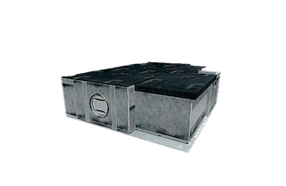

<div align="center">
  

  <br />
  <br />

  <h1>🏆 AWwWards Winner 2025 🏆</h1>
  <h3>Step Inside a Digital Universe</h3>

  <p>
    <strong>A next-generation, immersive 3D portfolio experience bridging the gap between imagination and modern web engineering.</strong>
  </p>

  <p>
    <a href="https://iamerfan.me">View Live Experience</a> •
    <a href="#-the-experience">The Experience</a> •
    <a href="#-technical-architecture">Architecture</a> •
    <a href="#-getting-started">Getting Started</a>
  </p>

  <div>
    
    
    
    
    
  </div>
</div>

---

## 🌟 The Experience

Welcome to a portfolio that defies conventional scrolling. Built from the ground up, this project transforms a standard web page into an **interactive, cinematic 3D environment**. Every object, every ray of light, and every shadow has been deliberately placed to guide you through a narrative of my technical journey and creative vision.

This project was recognized as a **2025 Web Design Award Winner** for its seamless integration of complex WebGL rendering, intuitive UX, and flawless frontend execution.

### ✨ Key Highlights

- 🎥 **Cinematic Camera Choreography**: Powered by **Theatre.js**, driving buttery-smooth, scroll-bound flight paths through the environment.
- 🎨 **Bespoke 3D Modeling**: Entirely custom-modeled in **Blender**, featuring Draco compression to deliver high-fidelity meshes over the wire with minimal latency.
- ⚡ **Zero-Compromise Performance**: Masterful React orchestration utilizing decoupled state loops (`useFrame`), memoization, and dynamic async imports (`next/dynamic`), ensuring 60FPS across devices despite heavy geometric payloads.
- 💡 **Advanced WebGL Lighting & Post-Processing**: Real-time bloom, vignette, noise grain, and baked-in global illumination imitating physically based rendering (PBR).

---

## 🏗️ Technical Architecture

This application represents the bleeding edge of the React ecosystem, leveraging React 19's concurrent rendering capabilities alongside the latest innovations in spatial computing for the web.

### Core Stack

| Layer            | Technologies                | Version      | Purpose                                                 |
| :--------------- | :-------------------------- | :----------- | :------------------------------------------------------ |
| **Framework**    | Next.js (App Router), React | 15.0+        | Server-side routing, SEO optimization, and hydration    |
| **3D Rendering** | Three.js, React Three Fiber | 0.170+, 9.0+ | Declarative 3D scene graph and WebGL context management |
| **Animation**    | Theatre.js                  | 0.7.2        | Keyframe animation timeline and scroll synchronization  |
| **Styling**      | Tailwind CSS                | 4.0          | Utility-first styling for UI overlays and typography    |
| **Optimization** | Draco, glTF-Transform       | Latest       | Asset compression and optimization                      |

---

## 🎮 Interactive Anatomy

The environment is designed to reward exploration. Raycasting is drastically optimized using spatial caching techniques to eliminate frame drops during interaction.

- 🚪 **The Door Lock** — _Gatekeeping the introduction._
- 🌍 **The Planets** — _Orbiting around deep technical skills and stack mastery._
- 📚 **The Bookshelf** — _A library of knowledge, continuous learning, and philosophies._
- 🎸 **The Setar** — _A nod to cultural roots and harmonic creativity._
- 💼 **The Portfolio Pods** — _Interactive nodes housing detailed case studies of previous work._

---

## 🚀 Getting Started

If you wish to explore the source code or run the project locally to study the architecture:

### Prerequisites

- Yarn or bun (Yarn recommended)
- A dedicated GPU or a modern integrated GPU (M-series Silicon, Intel Iris, etc.)

### Installation

```bash
# 1. Clone the repository
git clone https://github.com/erfan-mirasadi/Portfolio.git

# 2. Enter the directory
cd Portfolio

# 3. Install dependencies
yarn install

# 4. Spin up the development server
yarn dev
```

Navigate to `http://localhost:3000` to enter the environment.

### Production Build

```bash
# Build the highly-optimized production bundle
yarn build

# Run the production server
yarn start
```

---

## 🏆 Performance Milestones

Winning the **2025 Web Design Award** wasn't just about aesthetics; it was a triumph in **Web Performance**.

- **Time To First Byte (TTFB)** minimized via Next.js Dynamic Imports and SSR deferment.
- **Render blocking resources** bypassed by decoupling heavy geometries into background loaders.
- **Memory Leaks** eliminated through rigorous garbage collection logic (`.dispose()`) on WebGL materials and geometries.

---

## 📜 License & Copyright

**© 2025 Erfan Mirasadi.** All Rights Reserved.

_This is a proprietary personal portfolio. While the code is open for educational study and inspiration, commercial adoption, cloning, or redistribution of the 3D models and brand identity is strictly prohibited._

<div align="center">
  <br />
  <p><i>"The web is not a page; it is a canvas."</i></p>
</div>
